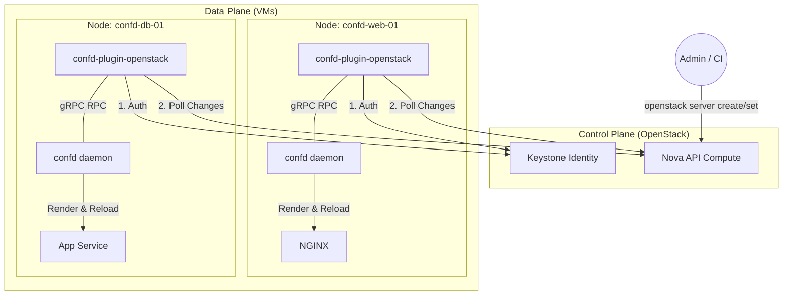
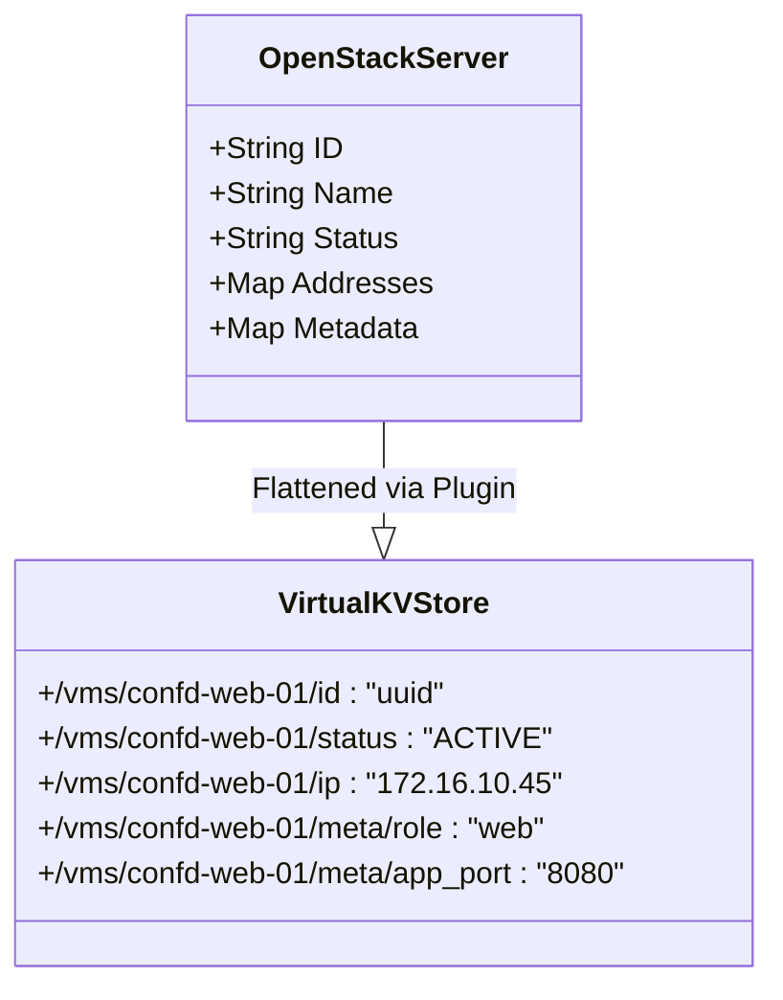
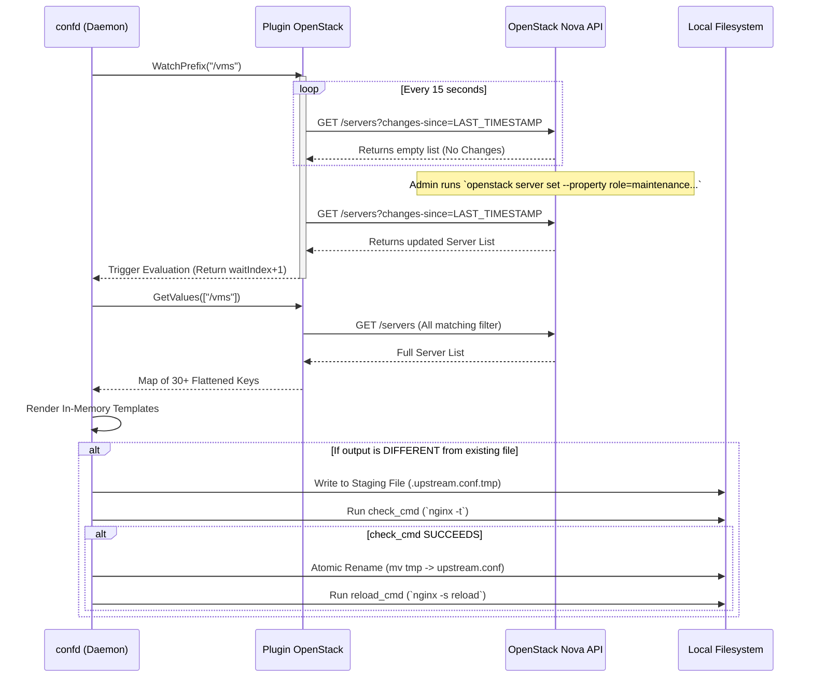

# OpenStack Event-Driven Configuration Management

Ce document détaille l'architecture, le fonctionnement technique, et la modélisation du système de gestion de configuration par événements (Event-Driven Configuration Management) utilisant `confd` couplé à notre plugin natif `confd-plugin-openstack`.

---

## 1. Vue d'Ensemble de l'Architecture

Le concept fondamental repose sur l'élimination de la nécessité d'un cluster de base de données externe (comme etcd, Consul ou Zookeeper) pour stocker l'état de l'infrastructure. Au lieu de cela, **l'API OpenStack (Nova) agit elle-même comme l'Unique Source de Vérité (SSOT)**.

### Schéma Logique Global



L'administrateur modifie l'état de l'infrastructure via la CLI OpenStack (création d'instances, modification des propriétés de métadonnées). Le plugin détecte ces changements et demande à `confd` d'agir.

---

## 2. Le Modèle de Données Virtuel (The Virtual Key-Value Store)

Puisque `confd` est conçu à l'origine pour requêter des bases de données clé-valeur (etcd, redis), notre plugin agit comme un traducteur. Il interroge la liste des serveurs OpenStack et construit virtuellement, en mémoire, un arbre hiérarchique.

### Traduction des Serveurs Nova

Lorsqu'un serveur est récupéré depuis l'API Nova, ses attributs (ID, IPs, statuts, propriétés personnalisées) sont aplatis.



### Mécanisme de Filtrage

Afin d'éviter que le load balancer n'intègre toutes les machines de l'infrastructure (par exemple, les environnements de dev ou les nœuds Kubernetes sans rapport), le plugin implémente un système de filtre strict configuré via la variable d'environnement `OS_CONFD_FILTER`. 

Si `OS_CONFD_FILTER="environment=demo"`, seuls les serveurs Nova disposant de la métadonnée `--property environment=demo` seront traduits dans le *Virtual Key-Value Store*.

---

## 3. Workflow de Synchronisation (Watch Mode)

Le défi d'une infrastructure basée sur OpenStack est qu'OpenStack n'offre pas par défaut un flux d'événements PUSH (comme les Watchers d'etcd). Le plugin doit donc implémenter un "Smart Polling".

### Diagramme de Séquence du Smart Polling



### Explication du "Changes-Since"

Pour ne pas surcharger l'API OpenStack et éviter le "Rate Limiting", le polling n'effectue pas une requête globale à chaque itération. Il utilise le paramètre `changes-since` de l'API Compute v2, ne retournant une charge utile que si un serveur a été modifié depuis le timestamp précédent.

---

## 4. Cycle de Vie des Configurations (Templates)

La génération des configurations dépend du moteur de template de Go, évalué par `confd`. 

La dépendance est déclarée dans un fichier `.toml` situé dans `/etc/confd/conf.d/`.

### Fichier TOML de Déclaration

```toml
[template]
src        = "nginx.conf.tmpl"
dest       = "/etc/nginx/conf.d/upstream.conf"
keys       = ["/vms"]
check_cmd  = "nginx -t -c /etc/nginx/nginx.conf"
reload_cmd = "nginx -s reload"
```

### Rendu Conditionnel par Méta-Données

Le fichier `.tmpl` associé utilise le répertoire virtuel `/vms` pour boucler sur tous les serveurs, mais utilise les métadonnées OpenStack pour les filtrer côté client.

```go
upstream backend_web {
{{- range $name := ls "/vms"}}
{{- $role := getv (printf "/vms/%s/meta/role" $name) ""}}
{{- if eq $role "web"}}
{{- $ip   := getv (printf "/vms/%s/ip" $name) ""}}
{{- $port := getv (printf "/vms/%s/meta/app_port" $name) "8080"}}
    server {{$ip}}:{{$port}};  # {{$name}}
{{- end}}
{{- end}}
}
```

La force de ce modèle est l'absence d'états asynchrones : si la VM OpenStack possède le tag `role=web`, elle apparaîtra dans le fichier. Si le tag est retiré ou remplacé par `role=maintenance`, le bloc `if eq` échouera, la VM sera retirée de la cible NGINX, et le trafic cessera immédiatement.

---

## 5. Modèle de Déploiement

Le déploiement est géré via un outil d'orchestration (`sup`) étendu par un parseur HCL2 (`sup-hcl2-parser`).

L'architecture est entièrement décentralisée :
1. **Pas de Master Node** : Chaque VM exécute son propre processus `confd` avec le plugin.
2. **Tolérance aux Pannes** : Si le load balancer s'arrête, les requêtes échouent, mais les workers peuvent continuer d'écouter les événements. Si un worker s'arrête, il est supprimé de l'infrastructure via l'API, et le load balancer met à jour sa configuration de manière autonome.

### Sourcing d'Environnement (Sécurité)

Afin d'autoriser le processus `confd` exécuté par `sudo` à communiquer avec l'API OpenStack, le fichier `/etc/confd/confd.env` est injecté dynamiquement et évalué via une commande `export $(grep -v ^# ... | xargs)` afin d'isoler les credentials de la session utilisateur standard.
